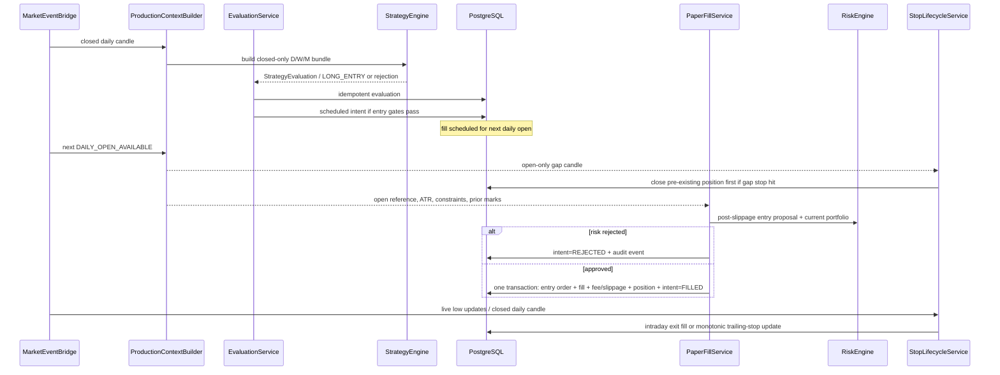

# Architecture and Runtime Map — Auditor B

Audit basis: Issue #371, branch `audit/full-system-behavior-verification`, commit
`7b78eb9996eb16e6d2ec6a00c2e1908c518682d9`. This document is an independent,
read-only reconstruction of the risk/paper runtime. Core implementation files were
unmodified while this evidence was collected. Concurrent audit-document edits in the
shared worktree are outside this auditor's conclusions.

## Evidence-status convention

| Layer | Meaning in this document |
|---|---|
| Soll | Binding specification or service contract |
| Code | Static implementation evidence at the audited commit |
| Test | Test actually executed in this audit, or an exact existing test reference |
| Runtime | Directly observed deployed behavior |
| Not checked | Explicit visibility or environment boundary |

No Railway or other deployed runtime was accessed. Every deployment claim below is
therefore `NOT_VERIFIABLE`, not a pass.

## Actual process and ownership topology

```text
Hyperliquid public market data
  -> HyperliquidMarketDataRuntime (inside paper worker)
  -> in-process MarketDataService / candle repository
  -> MarketEventBridge
  -> PaperTradingScheduler
       daily close: StrategyEngine -> persisted evaluation -> trade intent
       daily open:  gap-stop -> scheduled entry fill -> portfolio snapshot
       live update: intraday stop processing
  -> RiskEngine (called synchronously before an entry fill)
  -> PostgreSQL (runtime, intents, orders, fills, positions, wallet, snapshots)

PostgreSQL
  -> separate readonly FastAPI process
  -> Next.js server-side paper-api client
  -> authenticated dashboard
```

There is one intended economic writer: `PaperTradingApplication`. It creates a
session-scoped PostgreSQL advisory lock before recovery and scheduler activation
(`services/paper_trading/application.py:185-251`,
`services/paper_trading/lock.py:25-71`). The heartbeat uses a separate engine/session
but writes only runtime liveness (`services/paper_trading/application.py:581-644`).
The readonly API is a separate process; its paper endpoints are GET-only, while the
embedded worker control API is disabled by default in production
(`services/paper_trading/README.md:77-93`).

## Startup, steady-state, and shutdown sequence

```mermaid
sequenceDiagram
    participant O as Operator/Railway
    participant A as PaperTradingApplication
    participant DB as PostgreSQL
    participant L as Advisory-lock connection
    participant R as RecoveryService
    participant MD as Public market-data runtime
    participant S as Scheduler/Event bridge
    participant API as Readonly API/Dashboard

    O->>A: start-worker
    A->>DB: connect; verify database + Alembic head
    A->>L: pg_try_advisory_lock(lock_id)
    alt lock unavailable until timeout
        A-->>O: fail startup
    else lock acquired
        A->>R: recover_on_startup(market_data_ready=false)
        R->>DB: consistency checks + permitted repairs
        alt fatal issue
            R->>DB: runtime=FAILED
            A-->>O: fail startup
        else recoverable
            R->>DB: runtime=DEGRADED/SYNCING
            A->>MD: start public runtime and wait for readiness
            A->>S: enable scheduler; wire event bridge
            A->>DB: persist isolated heartbeat
            A->>DB: promote runtime to READY if prerequisites pass
        end
    end
    loop event poll
        A->>MD: process_live
        A->>S: process committed events only if lock held, MD ready, heartbeat healthy
        S->>DB: transactional scheduler/economic writes
        A->>DB: reevaluate readiness
        API->>DB: read runtime/economic state
    end
    O->>A: stop
    A->>DB: runtime=SHUTTING_DOWN; cancel loops
    A->>L: unlock
    A->>DB: runtime=STOPPED
```

The final two shutdown operations are ordered exactly as shown: the lock is released
at `services/paper_trading/application.py:355-356`, then `STOPPED` is written at
`services/paper_trading/application.py:358-362`. `expected_version` is checked only
against the SQLAlchemy identity-map row before flush
(`services/paper_trading/repository.py:99-131`), not in an atomic SQL `WHERE version =`
clause. This creates the successor-start interleaving in B-FINDING-08.

## Daily trading sequence



Positive ordering evidence is `services/paper_trading/scheduler.py:190-225` (gap stop
before entry fill) and `services/paper_trading/execution.py:345-449` (atomic successful
entry chain). Idempotency is enforced by unique intent, one-order-per-intent and fill
keys (`services/paper_trading/db/orm.py:85-149`, `:152-191`).

## Runtime contract matrix

| Invariant | Soll | Code | Test | Runtime | Status |
|---|---|---|---|---|---|
| Exactly one execution owner | One writer, advisory lock | Dedicated session lock acquired before recovery and all jobs (`application.py:205-251`; `lock.py:42-71`) | PostgreSQL lock tests exist, but this audit's run was blocked by local DB authentication | Not observed | `PARTIALLY_VERIFIED` |
| Strategy creates intent, not direct order | Strategy/evaluation before paper fill | Evaluation persists deterministic intent (`lifecycle.py:169-216`); fill service alone writes orders/fills (`execution.py:238-449`) | Unit execution/scheduler suites passed | Not observed | `VERIFIED` for code/test, not runtime |
| Stale/unready blocks new risk | Entry readiness must be fail-closed | App processes events only with MD readiness + healthy heartbeat (`application.py:646-664`); Risk proposal validates data/system state (`risk_engine/validation.py:129-186`) | readiness tests passed | Not observed | `PARTIALLY_VERIFIED`; pause/pending-fill exceptions below |
| Pause blocks entries | README says no new intents/entries (`services/paper_trading/README.md:88-91`) | Production context derives pause from enum status, not persistent flag (`scheduler_context.py:91-98`) | Existing E2E uses a different helper path (`tests/paper_trading/e2e/helpers.py:246-255`) | Not observed | `CONTRADICTED` — B-FINDING-01 |
| Kill/pause blocks already scheduled entry | FREEZE blocks new entries (`paper-trading-orchestrator-v1.md:33`) | Fill context has no readiness/kill/pause fields (`lifecycle.py:103-115`); fill path does not reread runtime (`lifecycle.py:242-319`); risk adapter defaults system state to ACTIVE (`backtester/paper_lifecycle.py:108-150`) | No pending-intent-after-kill/pause test found | Not observed | `CONTRADICTED` — B-FINDING-02 |
| Stops continue while paused | Open positions remain protected in FREEZE | Stop jobs are separate from entry gates (`scheduler.py:118-130`, `:461-480`) | readiness/stop unit suites passed | Not observed | `VERIFIED` in code/test only |
| Restart is idempotent | No duplicate intent/fill | Deterministic keys + recovery checks (`recovery.py:344-553`) | Existing PostgreSQL suites could not run here | Not observed | `PARTIALLY_VERIFIED` |
| Reconciliation mismatch freezes entries | Risk spec requires ERROR/freeze (`docs/risk-specification.md:292-298`) | Startup recovery does not call independent accounting reconstruction (`recovery.py:84-93`); READY path can complete after structural checks (`recovery.py:193-209`) | Accounting verifier has separate tests; PostgreSQL execution blocked here | Not observed | `CONTRADICTED` — B-FINDING-03 |
| No live/private execution | V1 explicitly excludes signing/orders | Paper fill code writes only local PostgreSQL; market-data runtime is public | Static search and code inspection only | No network/private action performed | `VERIFIED` statically; runtime not observed |

## Crash boundaries and ownership conclusions

- Entry order, entry fill, wallet fee, position and terminal intent are inside one
  transaction (`services/paper_trading/execution.py:357-443`). A rollback therefore
  protects the full persisted entry chain.
- Exit fill, wallet PnL/fee, and closed position are likewise in one transaction
  (`services/paper_trading/stops.py:269-326`).
- Scheduler run creation and economic handler work are separate transactions
  (`services/paper_trading/scheduler.py:322-371`). A crash can leave `RUNNING`, which
  startup recovery marks failed (`recovery.py:95-105`). Deterministic economic keys
  prevent normal replay duplication.
- Recovery's structural chain considers only wallet existence, not wallet economics
  (`recovery.py:143-163`), so atomicity failures are covered better than independent
  economic corruption. See B-FINDING-03.
- `RuntimeService` optimistic version checking is process-local rather than a database
  compare-and-swap (`repository.py:111-131`); combined with unlock-before-STOPPED this
  leaves a rolling-restart race. See B-FINDING-08.

## Not checked / not verifiable

- No Railway logs, service replica count, current deployment SHA, database fingerprint,
  private service connectivity, heartbeat cadence, or dashboard session was observed.
- No production/staging database was queried or mutated.
- Local PostgreSQL integration tests were attempted only against the explicit
  `paper_trading_test` database and failed before test setup due authentication; no
  test case executed and no migration/data mutation succeeded.
- No chaos kill, process overlap, network disconnect, or external API call was run.
- Partial-fill, cancel, and persistent protective stop-order behavior are not runtime
  features in the inspected implementation; enum/schema presence is not evidence of
  behavior (B-FINDING-07).
